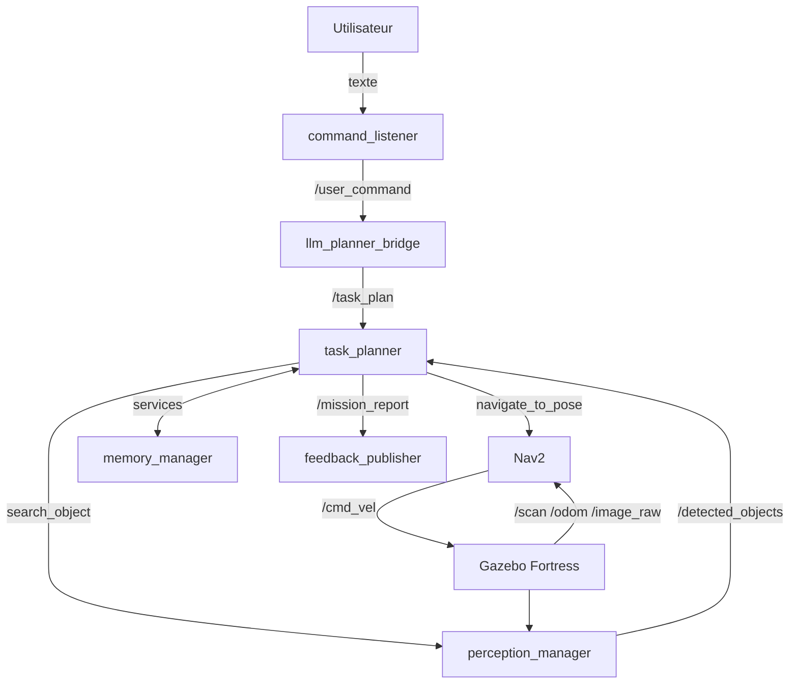
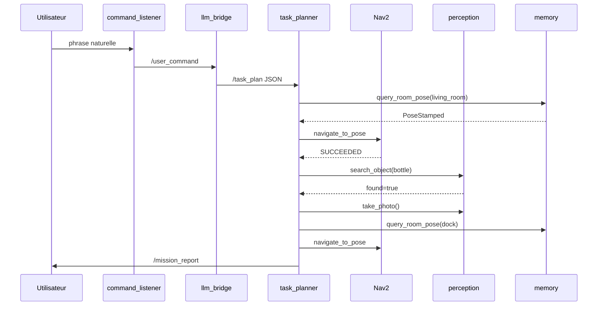
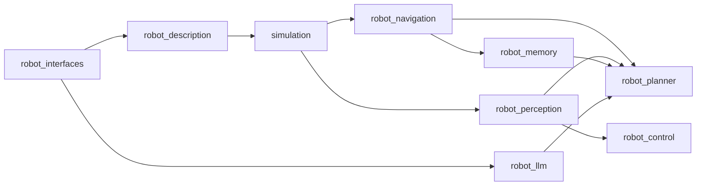

# Plan de développement — Assistant Domestique ROS 2

## Contexte et adaptations pour ton environnement

Tu es sur **ROS 2 Humble + Ubuntu 22.04** avec un profil **étudiant** (labs ROS 2/Gazebo déjà faits). Durée réaliste : **3 à 4 mois** à ~15 h/semaine.

| Guide (référence) | Ton environnement Humble |
|---|---|
| ROS 2 Jazzy + Ubuntu 24.04 | **ROS 2 Humble** + Ubuntu 22.04 |
| Gazebo Harmonic (`ros_gz`) | **Gazebo Fortress** via `ros-humble-ros-gz` |
| Python 3.12 | **Python 3.10** (compatible Ultralytics) |

> Ne mélange pas une install Gazebo "à la main" avec les paquets `ros_gz` vendor — c'est le piège n°1 sur Humble.

---

## Architecture cible (rappel)



**Principe directeur** : un package ROS 2 par module, testable isolément, relié par [`robot_interfaces`](robot_interfaces) (messages/services/actions custom).

---

## Étape 0 — Préparer l'environnement (Semaine 1, ~20 h)

### 0.1 Installation Humble (si pas déjà fait)

```bash
# Vérification
ros2 --version          # doit afficher humble
echo $ROS_DISTRO        # humble

# Paquets essentiels
sudo apt install ros-humble-desktop \
  ros-humble-navigation2 ros-humble-nav2-bringup \
  ros-humble-slam-toolbox ros-humble-robot-state-publisher \
  ros-humble-xacro ros-humble-joint-state-publisher-gui \
  ros-humble-ros-gz ros-humble-ros-gz-sim ros-humble-ros-gz-bridge \
  ros-humble-cv-bridge ros-humble-image-transport \
  ros-humble-vision-msgs python3-colcon-common-extensions
```

### 0.2 Workspace colcon

```bash
mkdir -p ~/ros2_ws/src
cd ~/ros2_ws
colcon build
echo "source ~/ros2_ws/install/setup.bash" >> ~/.bashrc
```

### 0.3 Git + structure du dépôt

Créer un repo `domestic-assistant-ros2` avec :

```text
domestic-assistant-ros2/
├── src/
│   ├── robot_interfaces/      # Phase 0
│   ├── robot_description/     # Phase 1
│   ├── simulation/            # Phase 1
│   ├── robot_navigation/      # Phase 2
│   ├── robot_perception/      # Phase 3
│   ├── robot_control/         # Phase 4 (optionnel)
│   ├── robot_llm/             # Phase 6
│   ├── robot_planner/         # Phase 7
│   └── robot_memory/          # Phase 8
├── .gitignore                 # exclure build/, install/, *.pt, *.bag, maps/*.pgm
└── README.md
```

### 0.4 Validation Phase 0

- `ros2 run demo_nodes_cpp talker` + `listener` fonctionnent
- `colcon build` sans erreur
- Comprendre : nodes, topics, services, actions, TF2, launch files, QoS

**Ressources** : [ROS 2 Humble Tutorials](https://docs.ros.org/en/humble/Tutorials.html) — au minimum Actions, TF2, URDF.

---

## Étape 1 — Robot simulé dans Gazebo (Semaines 2–3, ~15–20 h)

### 1.1 Package `robot_interfaces` (fondation, minimal)

Créer en premier avec `ament_cmake` + `rosidl_default_generators`. Définir dès maintenant les types qui seront enrichis plus tard :

| Fichier | Contenu initial |
|---|---|
| `msg/TaskAction.msg` | `string action_type`, `string[] params` |
| `msg/TaskPlan.msg` | `TaskAction[] actions`, `string raw_command` |
| `msg/MissionReport.msg` | `bool success`, `string[] step_results` |
| `srv/QueryRoomPose.srv` | `string room_name` → `geometry_msgs/PoseStamped pose`, `bool found` |
| `action/SearchObject.action` | goal: `string label` / result: `bool found`, `geometry_msgs/Pose pose` |

```bash
cd ~/ros2_ws
colcon build --packages-select robot_interfaces
source install/setup.bash
ros2 interface show robot_interfaces/msg/TaskPlan   # validation
```

### 1.2 Package `robot_description`

Fichiers clés à créer :

- [`urdf/robot.urdf.xacro`](urdf/robot.urdf.xacro) — robot différentiel 2 roues + caster
- [`urdf/sensors.xacro`](urdf/sensors.xacro) — LiDAR (`base_laser_link`), caméra RGB (`camera_link`), IMU
- [`urdf/wheels.xacro`](urdf/wheels.xacro) — joints continus roues motrices
- [`launch/display.launch.py`](launch/display.launch.py) — RViz sans Gazebo (debug URDF)
- Arbre TF cible (guide §2.7) :

```text
map → odom → base_footprint → base_link → {laser, camera, imu, wheels}
```

**Robot de départ recommandé** : TurtleBot3 ou un diff-drive custom simple (30×30 cm) — évite de bloquer 2 semaines sur la mécanique URDF.

### 1.3 Package `simulation`

- [`worlds/appartement.sdf`](worlds/appartement.sdf) — appartement minimal : salon, cuisine, couloir (murs + sol, pas besoin de meubles détaillés au début)
- [`launch/simulation.launch.py`](launch/simulation.launch.py) :
  1. Lance Gazebo Fortress avec le monde
  2. Spawne le robot depuis URDF
  3. Lance `robot_state_publisher`
  4. Bridge ROS ↔ Gazebo (`ros_gz_bridge`) pour `/scan`, `/odom`, `/cmd_vel`, `/camera/image_raw`

### 1.4 Validation Phase 1

| Test | Commande / observation |
|---|---|
| Robot visible Gazebo | lancer `simulation.launch.py` |
| TF cohérent | `ros2 run tf2_tools view_frames` |
| LiDAR | `ros2 topic echo /scan --once` |
| Caméra | `ros2 run rqt_image_view rqt_image_view` |
| Téléop manuel | `ros2 run teleop_twist_keyboard teleop_twist_keyboard` → robot bouge |

---

## Étape 2 — Navigation autonome Nav2 + SLAM (Semaines 4–7, ~30–40 h)

**Branche indépendante** — peut être faite en parallèle de la Phase 3.

### 2.1 Cartographie SLAM

1. Config [`robot_navigation/config/slam_toolbox_params.yaml`](robot_navigation/config/slam_toolbox_params.yaml)
2. Launch SLAM en mode online mapping
3. Téléopérer le robot pour explorer tout l'appartement (~10–15 min)
4. Sauvegarder la carte :

```bash
ros2 service call /slam_toolbox/save_map slam_toolbox/srv/SaveMap \
  "{name: {data: '/path/to/maps/appartement'}}"
```

→ produit `appartement.yaml` + `appartement.pgm`

### 2.2 Localisation AMCL + Nav2

Fichiers clés :

- [`config/nav2_params.yaml`](config/nav2_params.yaml) — costmaps, planner (`NavFn` ou `SmacPlanner`), controller (`RegulatedPurePursuit` ou `DWB`), recovery behaviors
- [`config/amcl_params.yaml`](config/amcl_params.yaml)
- [`launch/navigation.launch.py`](launch/navigation.launch.py) — AMCL + Nav2 avec carte pré-enregistrée

**Réglages critiques** (source de 50 % du temps de debug) :

- `robot_radius` et `inflation_radius` dans les costmaps
- `base_frame: base_footprint`, `global_frame: map`
- Vitesse max réaliste pour la simu (~0.2 m/s au début)

### 2.3 Positions des pièces (préparation Phase 8)

Créer manuellement un fichier [`config/room_poses.yaml`](config/room_poses.yaml) :

```yaml
rooms:
  kitchen:  {x: 2.0, y: 1.5, yaw: 1.57}
  living_room: {x: -1.0, y: 0.5, yaw: 0.0}
  dock: {x: 0.0, y: 0.0, yaw: 0.0}
```

Noter les poses dans RViz avec "2D Goal Pose" pendant que Nav2 tourne.

### 2.4 Validation Phase 2

- Mission manuelle : clic "Nav2 Goal" dans RViz → robot arrive sans collision
- 3 allers-retours entre pièces différentes
- Recovery behavior testé : placer un obstacle → robot se débloque ou échoue proprement

---

## Étape 3 — Perception YOLO (Semaines 4–7 en parallèle, ~20–25 h)

### 3.1 Prototype hors ROS (Semaine 4)

Avant d'intégrer ROS, valider YOLO seul :

```python
# test_yolo.py — script autonome
from ultralytics import YOLO
model = YOLO("yolo11n.pt")
results = model.predict(source="test_image.jpg", classes=[39])  # 39 = bottle COCO
```

Installer dans l'environnement Python système (pas un venv isolé si le node importe `rclpy` + `ultralytics` dans le même process) :

```bash
pip3 install ultralytics opencv-python
```

### 3.2 Package `robot_perception`

Fichiers clés :

- [`robot_perception/detector_node.py`](robot_perception/detector_node.py) — subscribe `/camera/image_raw`, inférence YOLO, publish `/detected_objects`
- [`robot_perception/depth_utils.py`](robot_perception/depth_utils.py) — estimation position 3D (RGB-D si depth dispo, sinon estimation monoculaire grossière)
- [`config/yolo_params.yaml`](config/yolo_params.yaml) — seuil confiance (0.5), classes cibles, modèle

Utiliser `vision_msgs/Detection2DArray` (déjà dans ROS) ou ton custom `robot_interfaces/Detection2DArray`.

### 3.3 Action `search_object`

Implémenter une **action ROS 2** (pas un service — durée variable, annulable) :

- Goal : `label: "bottle"`
- Feedback : nombre de frames scannées, confiance max actuelle
- Result : `found: true/false`, pose estimée

### 3.4 Validation Phase 3

- Placer une bouteille (objet Gazebo ou image) → détection publiée sur `/detected_objects`
- `ros2 action send_goal` sur `search_object` → retourne `found: true`
- Inférence ≥ 5 FPS sur ta machine (modèle `yolo11n` si CPU)

---

## Étape 4 — Suivi de personne PID (Semaines 8–9, optionnel, ~10–15 h)

Package `robot_control` :

- [`robot_control/pid_follower.py`](robot_control/pid_follower.py) — subscribe détections "person", publie `/cmd_vel`
- Action `follow_person` (start/stop)
- **Arbitrage `/cmd_vel`** : Nav2 et le follower ne doivent pas publier simultanément → utiliser un multiplexer ou désactiver Nav2 pendant le suivi

Validation : personnage Gazebo ou vidéo → robot maintient distance ~1 m.

---

## Étape 5 — Commandes simples sans LLM (Semaine 9, ~5–8 h)

Avant le LLM, valider la chaîne complète **sans** intelligence :

Package minimal `robot_bringup` ou node temporaire :

```python
# command_listener simplifié : mapping direct
COMMANDS = {
    "kitchen": TaskPlan(actions=[TaskAction(action_type="go_to", params=["kitchen"])]),
    "search bottle": TaskPlan(actions=[TaskAction(action_type="search", params=["bottle"])]),
}
```

- Node `command_listener` : lit stdin ou topic `/user_command`
- Node `task_planner` minimal (FSM) : exécute `go_to` via action Nav2

Validation : taper `"kitchen"` → robot va à la cuisine (pose depuis `room_poses.yaml`).

---

## Étape 6 — Intégration LLM (Semaines 10–11, ~12–18 h)

### 6.1 Prototype prompt hors ROS

Package `robot_llm`, fichiers :

- [`robot_llm/schema.py`](robot_llm/schema.py) — modèles Pydantic :

```python
class TaskAction(BaseModel):
    action: Literal["go_to", "search", "take_photo", "return_home"]
    target: str | None = None

class TaskPlanSchema(BaseModel):
    actions: list[TaskAction]
```

- [`robot_llm/prompt_template.py`](robot_llm/prompt_template.py) — prompt avec liste des pièces connues et actions autorisées
- [`robot_llm/llm_bridge_node.py`](robot_llm/llm_bridge_node.py) — subscribe `/user_command`, appelle API, valide JSON, publish `/task_plan`

**Recommandation** : commencer avec **API cloud** (Anthropic/OpenAI) pour des réponses fiables pendant le debug du prompt ; migrer vers Ollama local ensuite.

### 6.2 Validation Phase 6

| Entrée | Plan JSON attendu |
|---|---|
| "Va dans la cuisine" | `[{"action":"go_to","target":"kitchen"}]` |
| "Cherche une bouteille dans le salon" | `[{"action":"go_to","target":"living_room"},{"action":"search","target":"bottle"}]` |
| "Va chercher X dans Y et reviens" | `go_to → search → return_home` |

Tester 10 phrases variées ; taux de parsing valide > 90 %.

---

## Étape 7 — Planificateur de tâches (Semaines 12–13, ~15–20 h)

Package `robot_planner` — **cœur de l'intégration**.

### 7.1 FSM Python (recommandé sur Humble)

Plutôt qu'un Behavior Tree (`py_trees_ros` parfois pénible à compiler), une FSM explicite :

```python
class TaskPlanner(Node):
    states = ["IDLE", "EXECUTING", "WAITING_NAV", "WAITING_SEARCH", "REPORTING", "FAILED"]
    
    async def execute_plan(self, plan):
        for action in plan.actions:
            match action.action_type:
                case "go_to":
                    pose = await self.query_room_pose(action.params[0])
                    result = await self.nav_client.navigate_to_pose(pose)
                    if result != SUCCEEDED: self.handle_failure(...)
                case "search":
                    result = await self.search_client.search(action.params[0])
                case "return_home":
                    ...
```

### 7.2 Gestion d'erreurs

- Timeout par action (ex. navigation 120 s, search 60 s)
- Retry (1–2 tentatives sur échec Nav2)
- Fallback : objet non trouvé → publier échec propre dans `MissionReport`
- Annulation : `cancel_goal` sur action en cours si nouvelle commande

### 7.3 Validation Phase 7

Mission composite manuelle (plan hardcodé, pas LLM) :

```
go_to(kitchen) → search(bottle) → return_home()
```

→ `MissionReport` publié avec statut par étape.

---

## Étape 8 — Mémoire persistante (Semaine 14, ~8–12 h)

Package `robot_memory` :

- Backend SQLite ([`db_schema.sql`](db_schema.sql)) :

```sql
CREATE TABLE rooms (name TEXT PRIMARY KEY, x REAL, y REAL, yaw REAL);
CREATE TABLE objects (label TEXT, room TEXT, x REAL, y REAL, last_seen TIMESTAMP);
```

- Node `memory_server.py` — implémente `QueryRoomPose.srv` et `UpdateObject.srv`
- Migration initiale depuis `room_poses.yaml` (Phase 2)
- Le `task_planner` appelle `/memory/query_room_pose` au lieu de lire un YAML

Validation : redémarrer le robot → les poses de pièces persistent ; enregistrer position d'une bouteille trouvée.

---

## Étape 9 — Intégration finale (Semaines 15–16, ~15–25 h)

### 9.1 Launch global

[`simulation/launch/bringup_all.launch.py`](simulation/launch/bringup_all.launch.py) lance dans l'ordre :

1. Gazebo + robot
2. Navigation (AMCL + Nav2)
3. Perception (detector_node)
4. Memory server
5. LLM bridge
6. Task planner
7. Command listener + feedback publisher

### 9.2 Scénario de démonstration cible

> *"Va dans le salon, cherche une bouteille, prends une photo et reviens."*

Flux complet (guide §1.5) :



### 9.3 Checklist finale

- [ ] 3 missions composites réussies d'affilée
- [ ] Gestion propre d'un échec (objet absent)
- [ ] README avec commandes de lancement
- [ ] Enregistrement vidéo de démo (optionnel mais utile pour portfolio)

---

## Planning mensuel (profil étudiant, 4 mois)

| Mois | Contenu | Livrable clé |
|---|---|---|
| **M1** | Phase 0 + Phase 1 | Robot téléop dans Gazebo avec LiDAR + caméra |
| **M2** | Phase 2 ∥ Phase 3 | Carte SLAM + Nav2 point-à-point ; YOLO détecte bouteille |
| **M3** | Phase 5 + 6 + début 7 | Commande `"kitchen"` fonctionne ; LLM produit JSON valide |
| **M4** | Phase 7 + 8 + 9 | Mission complète autonome + démo |

---

## Ordre de création des packages (résumé)



---

## Pièges fréquents à anticiper

1. **QoS incompatibles** — caméra Gazebo en `best_effort`, subscriber en `reliable` → pas de messages. Aligner les profils QoS.
2. **TF extrapolation errors** — toujours utiliser `tf2_ros.Buffer.lookup_transform` avec le timestamp du message, pas `Time()` sans argument.
3. **Services vs Actions** — navigation et recherche d'objet = **actions** (durée variable, feedback, annulation).
4. **Python venv vs rclpy** — si le node ROS importe `ultralytics`, installer dans le même Python que `rclpy` (3.10 système sur Humble).
5. **Costmaps mal réglées** — robot bloqué dans les couloirs → réduire `inflation_radius` progressivement.
6. **Fichiers lourds dans Git** — `.gitignore` pour `*.pt`, `*.bag`, `maps/*.pgm` ; utiliser Git LFS si nécessaire.

---

## Première action concrète (aujourd'hui)

1. Vérifier que Humble + Gazebo Fortress tournent (`ros2 doctor`)
2. Créer `~/ros2_ws/src/domestic-assistant-ros2/`
3. Générer le package `robot_interfaces` avec les 3 messages minimaux
4. `colcon build && source install/setup.bash`
5. En parallèle : choisir le modèle de robot (TurtleBot3 existant vs diff-drive custom)

Une fois Phase 0–1 validées, tu auras un robot simulé téléopérable — base indispensable pour tout le reste.
