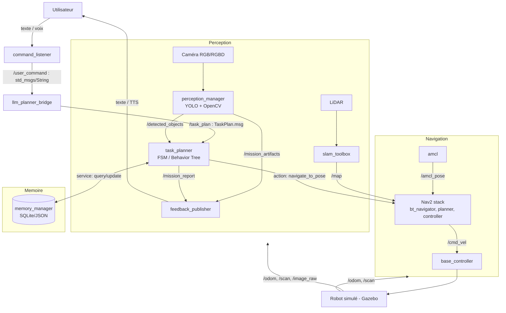
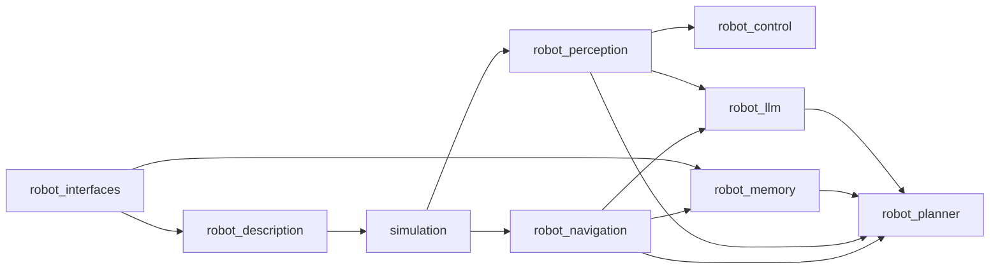

# Assistant Domestique Autonome sous ROS 2
## Dossier de conception et guide de réalisation complet

**Statut du document :** Partie 1 / N (en cours de rédaction)
**Périmètre de cette partie :** Vision globale — Architecture logicielle complète

---

# 1. Vision globale

## 1.1 Objectif exact du projet

Le projet consiste à concevoir, dans un premier temps en simulation (Gazebo), un **robot domestique autonome** capable de :

1. **Comprendre** une instruction formulée en langage naturel par un utilisateur (ex. *"Va dans la cuisine chercher une bouteille et reviens"*).
2. **Traduire** cette instruction en une séquence d'actions robotiques exécutables (`go_to(kitchen)`, `search(bottle)`, `return_home()`).
3. **Exécuter** cette séquence de façon autonome : se déplacer dans un environnement cartographié, détecter des objets dans son champ de vision, réagir aux imprévus (obstacle, échec de détection, cible introuvable).
4. **Rendre compte** à l'utilisateur du résultat de la mission (succès, échec, données collectées comme une photo).

Ce n'est donc pas seulement un projet de navigation, ni un projet de vision, ni un projet de LLM : c'est un projet d'**intégration système**, où la difficulté principale n'est pas un algorithme isolé mais la **communication fiable entre modules hétérogènes** (perception, décision, action) dans un cadre temps-réel contraint.

## 1.2 Quel problème le projet cherche-t-il à résoudre ?

Il répond à un problème classique en robotique de service : **combler le fossé entre une commande humaine abstraite et une exécution robotique concrète**. Ce fossé se décompose en plusieurs sous-problèmes que le projet adresse un par un :

| Sous-problème | Domaine concerné | Solution apportée dans le projet |
|---|---|---|
| Comprendre une phrase humaine ambiguë | NLU / LLM | LLM avec prompt structuré + parsing JSON |
| Savoir où l'on est et où aller | Localisation / Cartographie | SLAM Toolbox + AMCL + carte des pièces |
| Se déplacer sans collision | Navigation | Nav2 (planificateurs global/local, costmaps) |
| Reconnaître un objet dans le monde réel | Perception | YOLO + OpenCV |
| Enchaîner plusieurs actions et gérer les échecs | Orchestration | Planificateur de tâches (FSM / Behavior Tree) |
| Se souvenir de ce qui a déjà été vu/exploré | Mémoire | Base de connaissances persistante (SQLite/JSON) |

Ce découpage est important : chaque phase du projet (section 8 du présent guide) correspond à la résolution d'**un seul** de ces sous-problèmes à la fois, ce qui rend le projet abordable de façon incrémentale plutôt que comme un bloc monolithique intimidant.

## 1.3 Cas d'utilisation

Cas d'usage cibles, du plus simple (Phase 5) au plus complexe (Phase 9) :

1. **Navigation point à point** : *"Va dans le salon"* → le robot rejoint la pose associée à la pièce "salon" dans la carte.
2. **Recherche d'objet** : *"Cherche une bouteille"* → le robot explore une pièce, active la détection YOLO, s'arrête et signale s'il trouve l'objet.
3. **Mission composite** : *"Va dans la cuisine chercher une bouteille et reviens à la base"* → enchaînement `go_to` → `search` → `return_home`, avec gestion d'échec (ex. bouteille non trouvée → explorer une pièce adjacente ou abandonner proprement).
4. **Suivi de personne** (Phase 4, optionnel/démonstratif) : le robot détecte une personne et la suit à distance constante via un asservissement PID.
5. **Compte-rendu multimodal** : *"Va dans le salon, prends une photo et reviens"* → mission avec livrable (image) transmis à l'utilisateur en fin de mission.

## 1.4 Fonctionnalités principales

- Compréhension du langage naturel → plan d'actions structuré (LLM).
- Cartographie SLAM d'un appartement simulé et navigation autonome multi-pièces (Nav2).
- Détection d'objets et de personnes en temps réel (YOLO/OpenCV) avec publication ROS 2 des détections.
- Suivi de cible par asservissement visuel (PID).
- Planificateur de tâches robuste à l'échec (retry, fallback, abandon propre).
- Mémoire persistante de l'environnement (pièces, objets, dernières positions connues).
- Retour utilisateur (texte, éventuellement image) en fin de mission.

## 1.5 Fonctionnement complet du robot, du début à la fin d'une mission

Prenons l'exemple final visé en section 9 du cahier des charges : *"Va dans le salon, cherche une bouteille, prends une photo et reviens."*

**Étape 0 — Repos.** Le robot est à sa position de base (« dock »), tous les nodes lifecycle sont en état `inactive` sauf le node d'écoute de commandes.

**Étape 1 — Réception de la commande.** L'utilisateur tape (ou dicte, en évolution future) la phrase. Un node `command_listener` publie le texte brut sur un topic `/user_command` (`std_msgs/String`).

**Étape 2 — Interprétation LLM.** Le node `llm_planner_bridge` reçoit `/user_command`, construit un prompt structuré, interroge le LLM (API Anthropic ou Ollama local), reçoit une réponse JSON, la valide (schéma attendu : liste d'actions avec paramètres), puis publie un plan d'actions sur `/task_plan` (message custom `TaskPlan.msg`, voir §2.5).

**Étape 3 — Prise en charge par le planificateur.** Le node `task_planner` (FSM ou Behavior Tree, voir section 13) reçoit `/task_plan` et l'exécute action par action :
   - `go_to(living_room)` → appel de l'**action** Nav2 `navigate_to_pose` avec la pose associée à "living_room" (résolue via la mémoire, §14).
   - Pendant le déplacement, le node `nav2_bt_navigator` orchestre planification globale (`NavFn`/`SmacPlanner`), planification locale (`DWB`/`RegulatedPurePursuit`), costmaps, et recovery behaviors en cas de blocage.
   - Une fois arrivé (`navigate_to_pose` retourne `SUCCEEDED`), le planificateur déclenche `search(bottle)`.
- `search(bottle)` → le node `perception_manager` active YOLO sur le flux `/camera/image_raw`, publie les détections sur `/detected_objects` (message custom `Detection2DArray` ou équivalent). Le planificateur surveille ce topic ; si une bouteille est détectée avec une confiance suffisante, l'action est marquée `SUCCEEDED` et sa position 3D estimée (via la profondeur RGB-D ou une estimation monoculaire) est enregistrée en mémoire.
   - `take_photo()` → le node `perception_manager` sauvegarde une frame de `/camera/image_raw` sur disque et publie son chemin sur `/mission_artifacts`.
   - `return_home()` → nouvel appel `navigate_to_pose` vers la pose du dock.

**Étape 4 — Compte-rendu.** Le node `task_planner` publie l'état final de la mission sur `/mission_report` (succès/échec par étape, chemin de la photo). Un node `feedback_publisher` restitue ce compte-rendu à l'utilisateur (texte console dans un premier temps, TTS en évolution future).

**Étape 5 — Retour au repos.** Les nodes lifecycle non essentiels repassent en `inactive` pour économiser les ressources (et la batterie sur un robot réel).

Ce scénario complet est la colonne vertébrale à laquelle chaque phase du projet vient ajouter une brique fonctionnelle.

---

# 2. Architecture logicielle complète

## 2.1 Vue d'ensemble (diagramme Mermaid)



## 2.2 Vue d'ensemble (diagramme ASCII, flux temps-réel)

```text
                         ┌────────────────────┐
                         │      Utilisateur     │
                         └──────────┬───────────┘
                                    │ commande texte/voix
                                    ▼
                         ┌────────────────────┐
                         │  command_listener    │  (/user_command)
                         └──────────┬───────────┘
                                    ▼
                         ┌────────────────────┐
                         │ llm_planner_bridge    │  (LLM → JSON plan)
                         └──────────┬───────────┘
                                    ▼  (/task_plan)
                         ┌────────────────────┐
              ┌─────────►│    task_planner       │◄─────────┐
              │          │  (FSM / BT executor)   │          │
              │          └──────────┬───────────┘          │
   /detected_objects                │ action goals            │ service
              │                     ▼                          │ query/update
   ┌──────────┴─────────┐  ┌────────────────┐        ┌────────┴─────────┐
   │ perception_manager   │  │   Nav2 stack     │        │  memory_manager    │
   │  (YOLO + OpenCV)      │  │ (planner/ctrl)   │        │  (SQLite / JSON)   │
   └──────────┬───────────┘  └────────┬─────────┘        └────────────────────┘
              │ /image_raw            │ /cmd_vel
              ▼                       ▼
   ┌────────────────────────────────────────────┐
   │           Robot simulé (Gazebo)               │
   │   base_link, roues, caméra, LiDAR, IMU         │
   └────────────────────────────────────────────┘
```

## 2.3 Description de chaque module

| Module (package ROS 2) | Rôle | Entrées | Sorties |
|---|---|---|---|
| `robot_description` | Modèle URDF/Xacro du robot, TF statiques | — | `/robot_description`, TF |
| `robot_bringup` / `simulation` | Lance Gazebo + spawn du robot + tous les nodes (launch files) | — | orchestration |
| `robot_navigation` | Intègre Nav2 + SLAM Toolbox + AMCL | `/scan`, `/odom` | `/cmd_vel`, `/map` |
| `robot_perception` | Détection d'objets/personnes (YOLO+OpenCV), estimation de position | `/camera/image_raw`, `/camera/depth` | `/detected_objects`, `/mission_artifacts` |
| `robot_control` | Contrôleur bas niveau (PID de suivi, interface moteurs) | `/detected_objects`, `/odom` | `/cmd_vel` (mode suivi) |
| `robot_llm` | Pont vers le LLM, prompt engineering, parsing/validation | `/user_command` | `/task_plan` |
| `robot_planner` | Orchestrateur de mission (FSM/BT), gestion des erreurs | `/task_plan`, `/detected_objects`, actions Nav2 | `/mission_report`, appels d'actions |
| `robot_memory` | Base de connaissances persistante (pièces, objets, poses) | requêtes du planner | réponses (service) |
| `robot_interfaces` | Définitions des messages/services/actions custom | — | types partagés |

## 2.4 Topics ROS 2 principaux

| Topic | Type de message | Publisher | Subscriber(s) | Fréquence indicative |
|---|---|---|---|---|
| `/scan` | `sensor_msgs/LaserScan` | driver LiDAR (Gazebo plugin) | `slam_toolbox`, `nav2_costmap_2d` | 10–20 Hz |
| `/odom` | `nav_msgs/Odometry` | plugin diff-drive Gazebo | `slam_toolbox`, `amcl`, `nav2` | 30–50 Hz |
| `/camera/image_raw` | `sensor_msgs/Image` | plugin caméra Gazebo | `perception_manager` | 15–30 Hz |
| `/camera/depth/image_raw` | `sensor_msgs/Image` | plugin RGBD Gazebo | `perception_manager` | 15–30 Hz |
| `/map` | `nav_msgs/OccupancyGrid` | `slam_toolbox` | `nav2_costmap_2d`, `amcl` | événementiel |
| `/cmd_vel` | `geometry_msgs/Twist` | `nav2_controller` ou `robot_control` (mode suivi) | contrôleur diff-drive Gazebo | 20 Hz |
| `/user_command` | `std_msgs/String` | `command_listener` | `llm_planner_bridge` | événementiel |
| `/task_plan` | `robot_interfaces/TaskPlan` (custom) | `llm_planner_bridge` | `task_planner` | événementiel |
| `/detected_objects` | `robot_interfaces/Detection2DArray` (custom, ou `vision_msgs/Detection2DArray`) | `perception_manager` | `task_planner` | 10 Hz pendant recherche |
| `/mission_report` | `robot_interfaces/MissionReport` (custom) | `task_planner` | `feedback_publisher` | événementiel |
| `/tf`, `/tf_static` | `tf2_msgs/TFMessage` | `robot_state_publisher`, `slam_toolbox`, `amcl` | tous les nodes ayant besoin de transformées | continu |

## 2.5 Services ROS 2

| Service | Type | Serveur | Client(s) | Usage |
|---|---|---|---|---|
| `/memory/query_room_pose` | custom (`string room_name → geometry_msgs/PoseStamped`) | `memory_manager` | `task_planner` | résoudre "cuisine" → coordonnées (x,y,θ) |
| `/memory/update_object` | custom (`string label, geometry_msgs/Pose → bool`) | `memory_manager` | `perception_manager` / `task_planner` | enregistrer un objet détecté |
| `/slam_toolbox/save_map` | `slam_toolbox_msgs/SaveMap` | `slam_toolbox` | opérateur (Phase 2) | sauvegarder la carte construite |
| `/controller_server/get_parameters` | `rcl_interfaces/GetParameters` | `nav2_controller` | outils de debug | inspection paramètres |

> Choix de conception : les **services** sont réservés aux requêtes courtes, synchrones, sans état persistant côté serveur pendant l'appel (typiquement : interroger/écrire la mémoire). Tout ce qui dure dans le temps et doit pouvoir être annulé/suivi (navigation, recherche d'objet) passe par une **action**, jamais par un service — c'est une erreur fréquente chez les débutants (voir section 20).

## 2.6 Actions ROS 2

| Action | Type | Serveur | Client | Usage |
|---|---|---|---|---|
| `navigate_to_pose` | `nav2_msgs/action/NavigateToPose` | `bt_navigator` (Nav2) | `task_planner` | déplacement point à point avec feedback (distance restante) |
| `search_object` | custom (`string label → bool found, geometry_msgs/Pose`) | `perception_manager` | `task_planner` | recherche active d'un objet avec feedback (progression du scan de la pièce) |
| `follow_person` | custom (`start/stop → statut continu`) | `robot_control` | `task_planner` | suivi PID d'une personne détectée (Phase 4) |

Les actions sont préférées ici car elles offrent nativement : **feedback intermédiaire**, **annulation** (`cancel_goal`), et **statut asynchrone** — indispensable pour qu'un planificateur puisse interrompre une navigation si, par exemple, l'objet cherché est détecté en cours de route.

## 2.7 Arbre TF2

```text
map
 └── odom
      └── base_footprint
           └── base_link
                ├── base_laser_link      (LiDAR)
                ├── camera_link
                │    └── camera_optical_frame
                ├── imu_link
                └── wheel_left_link / wheel_right_link
```

- `map → odom` : publié par `amcl` (correction de dérive par recalage sur la carte).
- `odom → base_footprint` : publié par le plugin diff-drive Gazebo (odométrie roues), transformée continue et localement précise mais qui dérive dans le temps.
- `base_footprint → base_link → capteurs` : transformées **statiques**, publiées par `robot_state_publisher` à partir de l'URDF/Xacro.

Comprendre cette distinction (`odom` = continu mais dérive, `map` = discontinu mais recalé) est un prérequis théorique essentiel avant d'attaquer la Phase 2 (voir section 10).

## 2.8 Dépendances principales

**Dépendances ROS 2 (packages) :**
`nav2_bringup`, `nav2_bt_navigator`, `nav2_planner`, `nav2_controller`, `nav2_costmap_2d`, `nav2_amcl`, `slam_toolbox`, `robot_state_publisher`, `joint_state_publisher`, `xacro`, `gazebo_ros_pkgs`, `tf2_ros`, `rviz2`, `vision_msgs` (ou messages custom équivalents).

**Dépendances Python :**
`opencv-python`, `ultralytics` (YOLO), `numpy`, `rclpy`, `anthropic` (ou `ollama` en local), `pydantic` (validation du JSON retourné par le LLM), `sqlalchemy` ou `sqlite3` (mémoire).

**Dépendances système :** *(vérifié en juillet 2026)* Deux couples stables et bien documentés existent aujourd'hui :

| Distribution ROS 2 | Ubuntu | Support LTS jusqu'à | Gazebo par défaut (paquet officiel `ros_gz`) |
|---|---|---|---|
| **Jazzy Jalisco** (recommandé pour ce projet) | 24.04 | 2029 | **Gazebo Harmonic** |
| Humble Hawksbill | 22.04 | 2027 | Gazebo Fortress (Harmonic possible via dépôt non officiel osrfoundation) |

Il existe aussi des distributions plus récentes (**Kilted Kaiju**, sortie mi-2025, non-LTS ; **Lyrical Luth**, sortie en mai 2026 sur Ubuntu 26.04, nouvelle LTS) mais elles sont **déconseillées pour un premier projet étudiant** : écosystème de paquets tiers (Nav2, SLAM Toolbox, `ros_gz`, cartes de robots communautaires) encore peu porté/testé dessus, et très peu de tutoriels disponibles au moment de la rédaction. **Recommandation : ROS 2 Jazzy + Gazebo Harmonic**, qui offre le meilleur compromis nouveauté/maturité/documentation, avec Humble comme repli si le poste de travail impose Ubuntu 22.04.

> ⚠️ Piège classique : ne jamais mélanger un paquet Gazebo installé "à la main" (via `apt install gz-harmonic`) avec les paquets vendor `ros_gz` d'une autre paire distro/Gazebo — cela casse les plugins `libgazebo_ros_*` utilisés par le `robot_state_publisher` et les capteurs simulés.

---

---

**Statut du document :** Partie 2 / N
**Périmètre de cette partie :** Découpage du projet en sous-projets — Justification détaillée de chaque technologie

---

# 3. Découpage du projet en sous-projets

Le principe directeur est le suivant : **chaque sous-projet correspond à un package ROS 2 indépendant, testable isolément**, avec une interface d'entrée/sortie clairement définie via `robot_interfaces`. Cela permet de développer, tester et déboguer un module sans dépendre du reste de la chaîne (ex. tester `robot_perception` avec un bag ROS enregistré, sans lancer Nav2 ni le LLM).

## 3.1 `robot_interfaces`

| | |
|---|---|
| **Objectif** | Centraliser toutes les définitions de messages/services/actions custom, pour que tous les autres packages en dépendent sans dépendances circulaires. |
| **Contenu** | `msg/`, `srv/`, `action/` |
| **Fichiers clés** | `TaskPlan.msg`, `TaskAction.msg`, `Detection2DArray.msg` (ou usage direct de `vision_msgs`), `MissionReport.msg`, `SearchObject.action`, `FollowPerson.action`, `QueryRoomPose.srv`, `UpdateObject.srv` |
| **Packages ROS 2 dépendants** | `std_msgs`, `geometry_msgs`, `sensor_msgs`, `vision_msgs` |
| **Dépendances** | Aucune dépendance vers les autres sous-projets (c'est la fondation) |
| **Ordre de développement** | **En premier**, dès la Phase 0, même a minima — tout le reste en dépend. À enrichir au fil de l'eau. |

## 3.2 `robot_description`

| | |
|---|---|
| **Objectif** | Modéliser physiquement le robot (URDF/Xacro) : géométrie, inertie, capteurs, TF statiques. |
| **Contenu** | Fichiers Xacro modulaires (base, roues, capteurs), meshes STL/DAE optionnels, config RViz |
| **Fichiers clés** | `urdf/robot.urdf.xacro`, `urdf/wheels.xacro`, `urdf/sensors.xacro`, `launch/display.launch.py`, `rviz/robot.rviz` |
| **Packages ROS 2** | `xacro`, `robot_state_publisher`, `joint_state_publisher_gui`, `rviz2` |
| **Dépendances** | `robot_interfaces` (aucune direct, mais convention de noms de frames partagée) |
| **Ordre de développement** | Phase 1, en tout début de projet — rien ne peut avancer sans un robot visible dans RViz/Gazebo. |

## 3.3 `simulation`

| | |
|---|---|
| **Objectif** | Fournir le monde Gazebo (appartement simulé), le spawn du robot, et les launch files d'orchestration globale. |
| **Contenu** | Mondes `.sdf`/`.world`, plugins capteurs Gazebo, launch file principal |
| **Fichiers clés** | `worlds/appartement.sdf`, `launch/simulation.launch.py`, `launch/bringup_all.launch.py` |
| **Packages ROS 2** | `gazebo_ros`, `ros_gz_sim`, `ros_gz_bridge` |
| **Dépendances** | `robot_description` |
| **Ordre de développement** | Phase 1, en parallèle de `robot_description`. |

## 3.4 `robot_navigation`

| | |
|---|---|
| **Objectif** | Cartographier l'environnement et permettre une navigation autonome sans collision entre pièces. |
| **Contenu** | Configs Nav2 (YAML : costmaps, planificateurs, contrôleurs), configs SLAM Toolbox, launch files |
| **Fichiers clés** | `config/nav2_params.yaml`, `config/slam_toolbox_params.yaml`, `launch/navigation.launch.py`, `maps/appartement.yaml` + `.pgm` |
| **Packages ROS 2** | `nav2_bringup`, `slam_toolbox`, `nav2_amcl`, `nav2_costmap_2d`, `nav2_bt_navigator` |
| **Dépendances** | `robot_description` (TF), `simulation` (capteurs `/scan`, `/odom`) |
| **Ordre de développement** | Phase 2, après validation de la Phase 1. |

## 3.5 `robot_perception`

| | |
|---|---|
| **Objectif** | Détecter des objets/personnes dans le flux caméra et publier leurs positions en ROS 2. |
| **Contenu** | Node(s) Python d'inférence YOLO, post-traitement OpenCV, estimation de profondeur/position 3D |
| **Fichiers clés** | `robot_perception/detector_node.py`, `robot_perception/depth_utils.py`, `config/yolo_params.yaml`, `models/yolo11n.pt` |
| **Packages ROS 2** | `cv_bridge`, `image_transport`, `vision_msgs` |
| **Dépendances Python** | `ultralytics`, `opencv-python`, `numpy` |
| **Dépendances internes** | `robot_interfaces`, `simulation` (flux caméra) |
| **Ordre de développement** | Phase 3, peut être développée **en parallèle** de la Phase 2 (peu de couplage direct — bon candidat pour du travail en binôme). |

## 3.6 `robot_control`

| | |
|---|---|
| **Objectif** | Contrôle bas niveau spécifique (asservissement PID de suivi de personne), au-delà de ce que fait Nav2 en navigation classique. |
| **Contenu** | Node PID, interface `/cmd_vel` en mode "suivi" avec arbitrage par rapport à Nav2 |
| **Fichiers clés** | `robot_control/pid_follower.py`, `config/pid_gains.yaml` |
| **Packages ROS 2** | `geometry_msgs`, `robot_interfaces` |
| **Dépendances internes** | `robot_perception` (position de la cible) |
| **Ordre de développement** | Phase 4, après validation de la perception (§3.5). |

## 3.7 `robot_llm`

| | |
|---|---|
| **Objectif** | Traduire une commande en langage naturel en plan d'actions structuré exploitable par le planificateur. |
| **Contenu** | Node pont vers l'API LLM, gabarit de prompt, validation de schéma JSON |
| **Fichiers clés** | `robot_llm/llm_bridge_node.py`, `robot_llm/prompt_template.py`, `robot_llm/schema.py` (Pydantic) |
| **Packages ROS 2** | `robot_interfaces` |
| **Dépendances Python** | `anthropic` ou `ollama`, `pydantic` |
| **Dépendances internes** | `robot_interfaces` |
| **Ordre de développement** | Phase 6, peut être **prototypée très tôt hors ROS** (script Python autonome testant juste le prompt) avant intégration. |

## 3.8 `robot_planner`

| | |
|---|---|
| **Objectif** | Orchestrer l'exécution du plan d'actions : appels d'actions Nav2/perception, gestion des échecs, séquencement. |
| **Contenu** | FSM ou Behavior Tree, gestion de timeouts et de retries |
| **Fichiers clés** | `robot_planner/task_planner_node.py`, `behavior_trees/mission_bt.xml` (si BT via `py_trees_ros` ou `behaviortree_cpp`) |
| **Packages ROS 2** | `rclpy_action`, `robot_interfaces`, éventuellement `py_trees_ros` |
| **Dépendances internes** | `robot_navigation` (action `navigate_to_pose`), `robot_perception` (action `search_object`), `robot_memory` (service) |
| **Ordre de développement** | Phase 7, dernier bloc d'intégration — nécessite que les Phases 2 à 6 soient fonctionnelles isolément. |

## 3.9 `robot_memory`

| | |
|---|---|
| **Objectif** | Persister et servir la connaissance du robot sur son environnement (pièces, objets, poses). |
| **Contenu** | Service ROS 2 avec backend SQLite, schéma de base de données |
| **Fichiers clés** | `robot_memory/memory_server.py`, `robot_memory/db_schema.sql`, `robot_memory/models.py` |
| **Packages ROS 2** | `robot_interfaces` |
| **Dépendances Python** | `sqlite3` (stdlib) ou `sqlalchemy` |
| **Dépendances internes** | `robot_interfaces` |
| **Ordre de développement** | Phase 8, mais **le schéma de données peut être conçu dès la Phase 2** (table des poses de pièces) pour éviter de tout refaire plus tard. |

## 3.10 Ordre global de développement recommandé



Les branches `robot_navigation` (Phase 2) et `robot_perception` (Phase 3) sont **indépendantes l'une de l'autre** une fois `simulation` prêt : c'est le point idéal pour paralléliser le travail si le projet est fait à plusieurs.

---

# 4. Justification détaillée de chaque technologie

Pour chaque technologie : rôle dans le projet, avantages, difficultés rencontrées typiquement, alternatives possibles et pourquoi elles n'ont pas été retenues ici.

## 4.1 ROS 2 (Jazzy Jalisco recommandé)

- **Rôle :** middleware de communication inter-processus (pub/sub via DDS, services, actions) + écosystème d'outils (launch, TF2, RViz, lifecycle).
- **Avantages :** découplage fort entre modules (chaque node peut être redémarré/remplacé indépendamment), standard de facto en robotique académique et industrielle, DDS = découverte automatique sans master central (contrairement à ROS 1).
- **Difficultés typiques :** courbe d'apprentissage du système de build `colcon`/`ament`, subtilités de QoS (Quality of Service) DDS qui peuvent silencieusement empêcher deux nodes de communiquer si les profils ne sont pas compatibles, gestion des espaces de noms (namespaces) en multi-robot.
- **Alternatives :** ROS 1 (obsolète, EOL depuis mai 2025 — à proscrire pour un nouveau projet), frameworks propriétaires (ex. NVIDIA Isaac SDK) — écartés ici car moins ouverts et moins documentés pédagogiquement.

## 4.2 Gazebo (Harmonic)

- **Rôle :** simulateur physique 3D (dynamique rigide, capteurs virtuels bruités de façon réaliste : LiDAR, caméra, IMU) permettant de développer sans robot réel.
- **Avantages :** intégration native `ros_gz` avec ROS 2 Jazzy, moteur physique réaliste (ODE/Bullet/DART selon config), rendu de capteurs proche du réel (bruit, distorsion).
- **Difficultés typiques :** coût de calcul du rendu caméra (peut faire chuter le temps réel simulé si le monde est complexe), plugins capteurs parfois mal documentés, divergence de comportement physique entre simulation et réel ("sim-to-real gap") à anticiper si le projet est porté sur un robot réel plus tard.
- **Alternatives :** Webots (plus simple à prendre en main mais écosystème ROS 2 moins riche), Isaac Sim (rendu photoréaliste et RL, mais très gourmand en GPU et moins adapté à un cursus pédagogique standard), NVIDIA/PyBullet pour de la simulation légère sans rendu capteur réaliste.

## 4.3 RViz2

- **Rôle :** visualisation 3D de l'état du robot (TF, nuages de points LiDAR, carte, chemin planifié, marqueurs de détection) — outil de debug indispensable, pas un simulateur.
- **Avantages :** affichage temps réel de tous les topics ROS 2 pertinents, extensible par plugins (ex. afficher les bounding boxes YOLO en surimpression).
- **Difficultés typiques :** confusion fréquente chez les débutants entre RViz (visualisation pure, aucune physique) et Gazebo (simulation physique) — RViz ne "fait" rien avancer, il ne fait qu'afficher.
- **Alternatives :** Foxglove Studio (interface web moderne, bon pour l'enregistrement/replay de bags), mais RViz2 reste la référence pédagogique standard ROS 2.

## 4.4 Nav2

- **Rôle :** pile de navigation autonome complète : planification globale, planification locale, gestion des costmaps, comportements de récupération, orchestration via Behavior Tree interne.
- **Avantages :** hautement configurable par YAML sans recompilation, gère nativement les situations d'échec (robot bloqué, chemin obstrué), standard de l'industrie et de la recherche académique.
- **Difficultés typiques :** réglage des costmaps (rayon d'inflation, résolution) souvent sous-estimé — un mauvais réglage produit soit un robot qui frôle les murs, soit un robot qui refuse de passer dans un couloir pourtant franchissable ; multiplicité des plugins de contrôleur (`DWB` vs `RegulatedPurePursuit` vs `MPPI`) qui déroute au début.
- **Alternatives :** développer sa propre pile planification/contrôle (formateur pédagogiquement mais démesuré pour la portée de ce projet), `move_base` (ROS 1, obsolète).

## 4.5 SLAM Toolbox

- **Rôle :** construction de carte 2D par SLAM (Simultaneous Localization And Mapping) à partir du LiDAR, en mode cartographie ou en mode localisation pure une fois la carte figée.
- **Avantages :** successeur recommandé de `gmapping`/`cartographer` dans l'écosystème ROS 2, supporte le SLAM en ligne et la sauvegarde/rechargement de carte, bon compromis précision/légèreté pour un environnement d'appartement.
- **Difficultés typiques :** dérive en cas de zones peu texturées géométriquement (longs couloirs symétriques), nécessité de fermer des boucles ("loop closure") pour corriger les erreurs cumulées.
- **Alternatives :** `cartographer_ros` (plus lourd, meilleur pour de grands espaces), SLAM visuel (RTAB-Map) si caméra RGB-D privilégiée par rapport au LiDAR — écarté ici car le LiDAR reste plus robuste et plus simple pédagogiquement pour la Phase 2.

## 4.6 OpenCV

- **Rôle :** prétraitement d'image (redimensionnement, conversion colorimétrique), post-traitement des détections (dessin de bounding boxes, calculs géométriques), pont `cv_bridge` entre `sensor_msgs/Image` et tableaux NumPy.
- **Avantages :** bibliothèque de référence, performances C++ avec binding Python, énorme documentation.
- **Difficultés typiques :** confusion BGR/RGB (OpenCV lit en BGR par défaut, contrairement à la plupart des frameworks ML), gestion des types d'image ROS (`bgr8`, `rgb8`, `mono8`) via `cv_bridge`.
- **Alternatives :** Pillow (trop limité pour du traitement temps réel), scikit-image (orienté traitement scientifique, pas temps réel).

## 4.7 YOLO (Ultralytics — YOLO11 recommandé, YOLO26 en veille technologique)

- **Rôle :** détection d'objets et de personnes en temps réel dans le flux caméra.
- **Avantages :** API Python `ultralytics` très simple (`model.predict()`), modèles pré-entraînés sur COCO couvrant déjà "bottle", "person", "chair", "dining table", excellent compromis vitesse/précision pour de l'embarqué.
- **Précision de version *(vérifié juillet 2026)* :** Ultralytics recommande aujourd'hui **YOLO11** pour la stabilité en production, et propose depuis janvier 2026 **YOLO26**, optimisé pour l'edge et l'inférence NMS-free (utile si le projet est porté sur Jetson par la suite). Pour ce projet pédagogique, YOLO11 reste le choix le plus sûr : documentation et exemples communautaires plus abondants à ce jour.
- **Difficultés typiques :** temps d'inférence trop élevé sur CPU seul (nécessite de choisir un modèle "nano"/"small" pour rester temps réel sans GPU), classes COCO qui ne couvrent pas forcément tous les objets voulus (nécessite alors un ré-entraînement/fine-tuning, hors périmètre initial).
- **Alternatives :** MobileNet-SSD (plus léger mais moins précis), modèles personnalisés from scratch (démesuré pour la portée du projet).

## 4.8 Python

- **Rôle :** langage principal de tous les nodes ROS 2 métier (perception, LLM, planner, mémoire) via `rclpy`.
- **Avantages :** écosystème IA/ML quasi exclusivement Python (Ultralytics, PyTorch), rapidité de développement/itération, bonne lisibilité pédagogique.
- **Difficultés typiques :** performance moindre qu'en C++ pour du contrôle bas niveau très haute fréquence (non critique ici, la boucle de contrôle rapide est déléguée à Nav2/Gazebo, en C++).
- **Alternatives :** C++ (`rclcpp`) pour les nodes critiques en latence — envisageable en évolution future pour `robot_control`, mais Python suffit largement pour un projet de cette portée.

## 4.9 Ollama / API LLM (Anthropic ou autre)

- **Rôle :** moteur d'inférence du LLM chargé de traduire la commande en plan d'actions structuré.
- **Avantages d'Ollama (local) :** aucune dépendance réseau, aucun coût par requête, contrôle total des données (pertinent si le projet doit un jour tourner "on-device" sur un robot réel isolé du réseau).
- **Avantages d'une API cloud (Anthropic, etc.) :** modèles bien plus capables pour du raisonnement/planification fiable, pas de contrainte de VRAM locale, mise à jour continue du modèle.
- **Difficultés typiques :** latence réseau si API cloud (à masquer par un feedback utilisateur "je réfléchis…"), hallucination de noms d'actions non prévus dans le schéma → nécessite une validation stricte côté code (voir section 12) quelle que soit l'option choisie.
- **Recommandation pour ce projet :** développer et déboguer avec une API cloud (retours plus fiables pendant l'apprentissage du prompt engineering), puis, en évolution, migrer vers Ollama local pour la démonstration finale "embarquée".

## 4.10 Git / GitHub

- **Rôle :** gestion de versions du code, historique, collaboration, portfolio public.
- **Avantages :** standard universel, intégration CI possible (lint, tests automatiques à chaque push), traçabilité de l'évolution du projet (utile pour un rapport de soutenance).
- **Difficultés typiques :** fichiers volumineux (cartes, modèles YOLO `.pt`, bags ROS) qui gonflent le dépôt si non gérés via `.gitignore`/Git LFS.
- **Alternatives :** GitLab (équivalent fonctionnel, moins visible pour un portfolio public étudiant) — GitHub reste préférable pour la visibilité recruteur (voir section 20).

## 4.11 TF2

- **Rôle :** gestion des transformations géométriques entre repères (capteurs, base, carte) dans le temps, avec interpolation temporelle.
- **Avantages :** évite de recalculer "à la main" les changements de repère (ex. convertir une détection en repère caméra vers le repère carte), gestion native des timestamps pour éviter d'utiliser une transformée périmée.
- **Difficultés typiques :** erreurs classiques de type *"Lookup would require extrapolation into the future/past"* quand les horloges ou les fréquences de publication TF ne sont pas cohérentes — un des messages d'erreur les plus fréquents en ROS 2 pour un débutant.
- **Alternatives :** aucune sérieuse — TF2 est la solution standard incontournable en ROS 2, il n'y a pas de justification à le réimplémenter.

---

---

**Statut du document :** Partie 3 / N
**Périmètre de cette partie :** Matériel pour un robot réel — Temps de développement et planning par profil

---

# 5. Matériel (pour un futur portage sur robot réel)

Le projet est mené en simulation, mais concevoir dès maintenant en ayant en tête le matériel réel évite de prendre de mauvaises habitudes (ex. dépendre d'une odométrie parfaite que seule la simulation offre).

## 5.1 Calculateur embarqué

| Critère | Recommandation | Justification |
|---|---|---|
| **CPU** | ARM 6-8 cœurs (Jetson) ou x86 4 cœurs+ (mini PC) | ROS 2 + Nav2 + planner tournent bien en multi-cœur ARM ou x86 récent |
| **RAM** | 8 Go minimum, **16 Go conseillés** | YOLO + Nav2 + LLM local (si Ollama) simultanés saturent vite 8 Go |
| **GPU** | Indispensable pour YOLO temps réel embarqué | Sur CPU seul, un modèle YOLO "nano" tourne péniblement à 2-5 FPS |
| **Stockage** | SSD NVMe 128 Go+, **jamais de carte microSD en usage prolongé** | La microSD est un goulot d'étranglement en écriture (logs ROS 2, cartes SLAM) et s'use vite |

*(Vérifié juillet 2026)* Comparatif des cartes réellement disponibles aujourd'hui :

| Carte | Prix indicatif | Puissance IA | Avantages | Limites |
|---|---|---|---|---|
| **NVIDIA Jetson Orin Nano Super** (recommandé) | ~249 $ (8 Go) | 67 TOPS | GPU CUDA dédié, tourne YOLO11 en temps réel confortable, écosystème Isaac ROS | Consommation 7–25 W, nécessite alimentation soignée |
| Raspberry Pi 5 (8 Go) | ~80 $ | Aucun GPU IA dédié | Très bien documenté, communauté énorme, parfait pour navigation/planner | YOLO temps réel très limité sans accélérateur externe (ex. Hailo-8) |
| Mini PC x86 (type Intel N100) | ~150–300 € | CPU only (ou GPU intégré léger) | Compatibilité logicielle x86 maximale (utile pour debug identique au PC de dev) | Consommation et encombrement supérieurs à l'ARM |

> Jetson Nano (l'ancien modèle 2019) est **obsolète et déconseillé** : fin de support logicielle, JetPack figé sur une vieille base Ubuntu 18.04 incompatible avec ROS 2 récent.

## 5.2 Capteurs

| Capteur | Modèle typique | Rôle | Prix indicatif |
|---|---|---|---|
| LiDAR 2D | Slamtec RPLidar A1 ou C1 (plus récent, moins cher, meilleure portée) | SLAM, évitement d'obstacles | ~100–180 $ |
| Caméra RGB | Webcam USB ou Raspberry Pi Camera Module 3 | Détection YOLO | 20–50 € |
| Caméra RGB-D | Intel RealSense D435i (profondeur + IMU intégré) | Estimation de distance/position 3D des objets détectés | ~350–450 $ |
| IMU | Intégré au RealSense, ou BNO055 autonome | Orientation, fusion avec l'odométrie roues | 15–30 € (si autonome) |
| Encodeurs | Intégrés aux moteurs réducteurs (ex. JGA25-371) | Odométrie roues | inclus dans le moteur |
| Micro | Micro USB directionnel ou array (ex. ReSpeaker) | Commande vocale (évolution future) | 20–60 € |
| Haut-parleur | Petit haut-parleur USB/I2S | Retour vocal TTS (évolution future) | 10–20 € |

## 5.3 Actionneurs

- **Moteurs :** DC à réducteur avec encodeur intégré (ex. JGA25-371, ~15–25 €/unité), configuration différentielle à 2 roues motrices classique en robotique mobile pédagogique.
- **Roues :** diamètre 65–100 mm, bande de roulement caoutchouc pour adhérence sur sol intérieur, + une roue folle (caster) pour la stabilité statique.
- **Contrôleur moteur :** driver double pont en H (ex. Cytron MDD10A) piloté soit directement par le calculateur principal, soit — **meilleure pratique** — par un microcontrôleur dédié (STM32/ESP32 via micro-ROS) qui gère la boucle de courant/vitesse en temps réel dur, déchargeant le calculateur principal.
- **Alimentation :** batterie Li-ion/LiPo 12V avec BMS (Battery Management System) pour la sécurité, régulateurs séparés pour la logique (5V) et la puissance moteur.

## 5.4 Budget estimé d'un robot réel

| Configuration | Composants clés | Budget total indicatif |
|---|---|---|
| **Budget étudiant** | Raspberry Pi 5, RPLidar A1, webcam, châssis imprimé 3D/DIY, moteurs basiques | ~400–600 € |
| **Recommandée** | Jetson Orin Nano Super, RPLidar C1, RealSense D435i, châssis usiné/imprimé, moteurs à encodeurs | ~900–1300 € |
| **Avancée** (bras robotique, meilleure autonomie) | Idem + bras 4-6 DOF, batterie plus grosse, capteurs redondants | ~1500–2500 € |

*(Prix indicatifs juillet 2026, hors frais de port/douane, à titre d'ordre de grandeur — vérifier les tarifs actuels avant tout achat réel.)*

---

# 6. Temps de développement estimé

## 6.1 Estimation par phase et par profil

Hypothèses de rythme : **débutant** = découvre ROS 2 en même temps que le projet ; **étudiant** = a déjà suivi un cours d'introduction à ROS 2 (ce qui correspond au profil ayant déjà fait les labs ROS2/Gazebo/RViz d'un cursus type IN426) ; **ingénieur confirmé** = pratique ROS 2 professionnellement.

| Phase | Débutant | Étudiant | Ingénieur confirmé |
|---|---|---|---|
| 0 — Découverte ROS 2 | 40–60 h (2–3 sem.) | 20–30 h (1–1,5 sem.) | 5–10 h (1–2 j) |
| 1 — Construction du robot (URDF/Xacro) | 30–40 h | 15–20 h | 5–8 h |
| 2 — Navigation autonome (Nav2/SLAM) | 60–80 h | 30–40 h | 10–15 h |
| 3 — Vision (YOLO/OpenCV) | 40–50 h | 20–25 h | 8–10 h |
| 4 — Suivi de personne (PID) | 20–30 h | 10–15 h | 4–6 h |
| 5 — Commandes simples | 10–15 h | 5–8 h | 2–3 h |
| 6 — Intégration LLM | 25–35 h | 12–18 h | 5–8 h |
| 7 — Planificateur | 30–40 h | 15–20 h | 8–12 h |
| 8 — Mémoire | 15–20 h | 8–12 h | 3–5 h |
| 9 — Démonstration finale (intégration + débogage) | 30–50 h | 15–25 h | 8–15 h |
| **Total** | **≈ 300–420 h** | **≈ 150–210 h** | **≈ 60–90 h** |

## 6.2 Traduction en planning réaliste

| Profil | Rythme réaliste | Durée totale du projet |
|---|---|---|
| Débutant | ~10 h/semaine (à côté d'autres cours) | **7 à 9 mois** |
| Étudiant (niveau école d'ingénieur, déjà formé à ROS 2) | ~15 h/semaine | **3 à 4 mois** — cohérent avec la roadmap "4 mois" du document d'origine |
| Ingénieur confirmé | Temps plein (~35 h/semaine) | **2 à 3 semaines** de développement pur, mais compter 4–5 semaines avec intégration/tests/documentation |

> Le **profil "étudiant"** est celui pour lequel la roadmap en 4 mois du cahier des charges d'origine est réaliste, **à condition** de traiter les Phases 2 et 3 en parallèle (voir §3.10) et de ne pas sous-estimer la Phase 9 (l'intégration finale prend systématiquement plus de temps que prévu — prévoir une marge de 20-30 % en fin de projet, c'est la phase la plus fréquemment sous-estimée par les étudiants).

## 6.3 Planning mensuel réaliste (profil étudiant, 4 mois, ~15h/semaine)

| Mois | Semaines | Contenu |
|---|---|---|
| Mois 1 | S1–S4 | Phase 0 (découverte ROS 2) → Phase 1 (robot dans Gazebo) |
| Mois 2 | S5–S8 | Phase 2 (SLAM + Nav2) **en parallèle avec** début Phase 3 (détection YOLO hors intégration ROS) |
| Mois 3 | S9–S12 | Fin Phase 3 (intégration ROS de la perception) → Phase 4 (suivi, optionnel) → Phase 5 (commandes simples) → début Phase 6 (LLM) |
| Mois 4 | S13–S16 | Fin Phase 6 → Phase 7 (planificateur) → Phase 8 (mémoire) → Phase 9 (intégration finale + démonstration + documentation) |

Un découpage semaine par semaine plus fin sera détaillé en section 16.

---

---

# Annexe — Adaptations pour un déploiement imposé sur ROS 2 Galactic

Cette annexe documente les écarts à appliquer par rapport aux recommandations Jazzy/Harmonic des sections précédentes, dans le cas — imposé ici — d'un environnement **ROS 2 Galactic Geochelone** (Ubuntu 20.04, EOL depuis novembre 2022).

## A.1 Ce qui ne change pas

- La quasi-totalité de l'architecture (§2), du découpage en sous-projets (§3) et le package `robot_interfaces` déjà livré : `ament_cmake` + `rosidl_default_generators` ont une API stable depuis Foxy, aucune modification nécessaire.
- `vision_msgs` est disponible en paquet binaire sur Galactic (`ros-galactic-vision-msgs`) — l'alternative mentionnée dans le README de `robot_interfaces` reste valable.
- YOLO/Ultralytics est **totalement indépendant de ROS 2** (simple script/nœud Python appelant la lib) : aucun impact direct de la distro sur la Phase 3, à un détail de version Python près (voir A.3).

## A.2 Ce qui change côté simulation

| Aspect | Recommandation Jazzy (sections précédentes) | Adaptation Galactic |
|---|---|---|
| OS | Ubuntu 24.04 | **Ubuntu 20.04 (Focal)** — imposé |
| Simulateur | Gazebo Harmonic (`ros_gz`) | **Gazebo Classic 11** (`gazebo_ros_pkgs`) |
| Spawn du robot | `ros_gz_sim create` | `gazebo_ros` : node `spawn_entity.py` |
| Plugins capteurs | plugins `gz-sim-*` | plugins historiques `libgazebo_ros_ray_sensor.so`, `libgazebo_ros_camera.so`, `libgazebo_ros_imu_sensor.so` |

Ce sont les plugins que tu as très probablement déjà utilisés en Labs 2/3 d'IN426 — la syntaxe Xacro/SDF ne change donc pas par rapport à ce que tu connais déjà.

## A.3 Ce qui change côté logiciel embarqué

- **Python** : Ubuntu 20.04/Galactic tourne sous **Python 3.8** système, celui utilisé par `rclpy`. Ultralytics exige officiellement Python ≥ 3.8 (donc ça passe), mais les tutoriels/exemples les plus récents sont testés en 3.10+. **Piège à anticiper** : ne pas créer un venv avec un Python plus récent pour YOLO sans faire attention — `rclpy` doit rester lié au Python système 3.8 du nœud ROS 2, donc si `perception_manager` est un nœud ROS 2 qui importe `ultralytics` directement, il faut installer `ultralytics` **dans l'environnement Python 3.8 système** (`pip3 install ultralytics`), pas dans un venv isolé à part, sous peine de `ModuleNotFoundError` au lancement du nœud.
- **Si le calculateur cible est un Jetson Nano de génération JetPack 4.x** (courant sur du matériel d'école datant de l'ère Galactic) : attention, ce JetPack embarque **Python 3.6**, incompatible avec Ultralytics (minimum 3.8). Dans ce cas précis, isoler l'inférence YOLO dans un **conteneur Docker séparé** (avec son propre Python 3.8+) qui communique avec le reste du système via ROS 2 (le pont `ros:galactic` existe en image Docker officielle) est la solution la plus sûre — plutôt que de tenter de faire cohabiter deux Python sur le même OS hôte.

## A.4 Ce qui change côté Nav2 / SLAM Toolbox

- `ros-galactic-navigation2` et `ros-galactic-slam-toolbox` existent bien en paquets binaires et restent installables via `apt` aujourd'hui (les dépôts des distributions EOL ne sont pas supprimés, seulement plus mis à jour) : `sudo apt install ros-galactic-navigation2 ros-galactic-slam-toolbox`.
- **Contrôleur Nav2 :** le plugin **MPPI** (Model Predictive Path Integral), plus récent, n'existe pas encore dans la version packagée pour Galactic. Utilise **`DWB`** (`dwb_core::DWBLocalPlanner`) ou **`RegulatedPurePursuit`**, tous deux disponibles et suffisants pour ce projet.
- Le reste (costmaps, `bt_navigator`, `amcl`, recovery behaviors) est fonctionnellement identique à ce qui est décrit en section 10 — seule la configuration YAML de certains plugins récents change de nom/paramètres, à vérifier au cas par cas dans `ros-galactic-navigation2`.

## A.5 Ce qui change côté planificateur (§13)

`py_trees_ros` (utile pour un Behavior Tree en Python) n'a pas toujours de paquet binaire garanti pour une distro aussi ancienne et non-LTS — sa disponibilité doit être vérifiée avant de s'engager dessus, avec un risque de devoir le compiler depuis les sources. **Recommandation spécifique à Galactic : partir sur une FSM Python "à la main"** (une classe `TaskPlanner` avec un `dict` d'états et de transitions, sans dépendance externe) plutôt qu'un Behavior Tree — cela réduit le risque de blocage sur un paquet non maintenu, pour un gain fonctionnel négligeable à l'échelle de ce projet (voir le comparatif FSM vs BT détaillé en section 13, à paraître).

## A.6 Recommandation générale

Si tu as le choix de l'isolation (même si la distro ROS 2 est imposée par le labo), développe si possible dans un **conteneur Docker `osrf/ros:galactic-desktop`** plutôt qu'en installation native sur ta machine personnelle : cela évite de "polluer" ton poste avec un Ubuntu 20.04 vieillissant, tout en donnant un environnement identique à celui du labo pour la reproductibilité du projet.

---

*Fin de la Partie 3 (annexe Galactic incluse). La Partie 4 couvrira la section 7 (Difficulté de chaque phase, erreurs classiques, pièges, bonnes pratiques) et démarrera la section 8. Dis-moi quand tu veux que je continue.*
